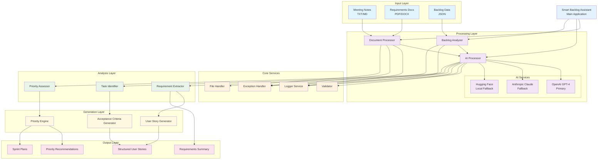
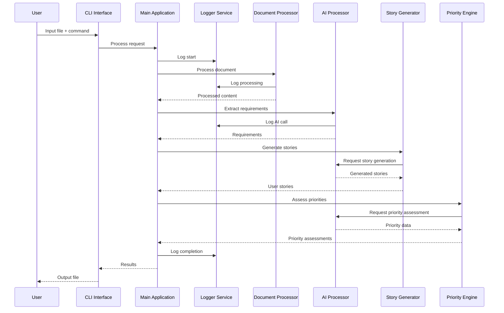

# Smart Backlog Assistant - Solution Design

## Architecture Overview

### Mermaid Architecture Diagram



### Component Flow Diagram



## Component Details

### 1. Input Processing
- **Document Processor**: Handles PDF extraction, text parsing, and format normalization
- **File Handler**: Manages different input formats (TXT, MD, PDF, JSON)
- **Validation**: Ensures input data integrity and format compliance

### 2. AI Integration Strategy
- **Primary AI Service**: OpenAI GPT-4 for complex reasoning and user story generation
- **Secondary AI Service**: Anthropic Claude for requirement analysis and validation
- **Fallback Service**: Hugging Face transformers for offline processing capability
- **Prompt Engineering**: Specialized prompts for each processing stage

### 3. Core Processing Pipeline
1. **Input Normalization**: Convert all inputs to standardized format
2. **Content Analysis**: Extract key information using AI
3. **Requirement Mapping**: Identify and categorize requirements
4. **Task Generation**: Create actionable tasks from requirements
5. **Priority Assessment**: Evaluate importance and urgency
6. **Output Formatting**: Generate structured deliverables

### 4. Data Flow
```
Raw Input → Preprocessing → AI Analysis → Task Extraction → 
Priority Assessment → User Story Generation → Output Formatting
```

## AI Prompt Design Strategy

### Requirement Extraction Prompt
```
Role: Senior Business Analyst
Task: Extract engineering requirements from the following content
Output Format: Structured list with priority indicators
Context: Engineering backlog management
```

### User Story Generation Prompt
```
Role: Product Owner
Task: Convert technical requirements into user stories
Format: As a [user], I want [functionality] so that [benefit]
Include: Acceptance criteria, priority level, effort estimate
```

### Priority Assessment Prompt
```
Role: Engineering Manager
Task: Assess priority based on business impact, technical complexity, dependencies
Output: High/Medium/Low with reasoning
```

## Error Handling Strategy
- **API Failures**: Graceful fallback between AI services
- **Input Validation**: Pre-processing validation with clear error messages
- **Partial Processing**: Continue processing even if some inputs fail
- **Logging**: Comprehensive logging for debugging and monitoring

## Scalability Considerations
- **Modular Design**: Each component can be scaled independently
- **API Rate Limiting**: Built-in rate limiting and retry logic
- **Caching**: Cache AI responses for similar inputs
- **Batch Processing**: Support for processing multiple documents

## Security & Best Practices
- **API Key Management**: Environment variables for sensitive data
- **Input Sanitization**: Prevent injection attacks
- **Data Privacy**: No persistent storage of sensitive content
- **Error Logging**: Avoid logging sensitive information
