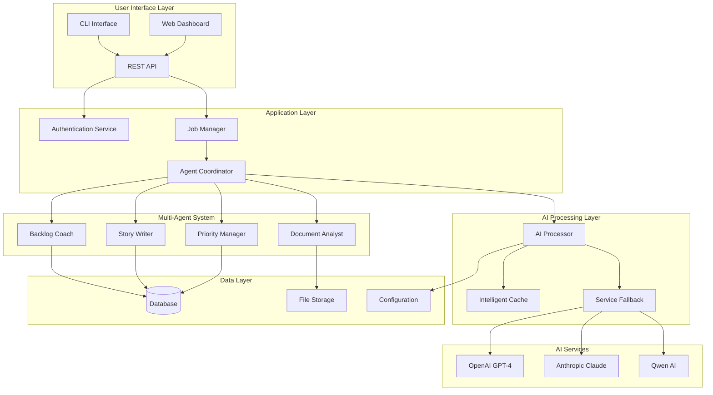
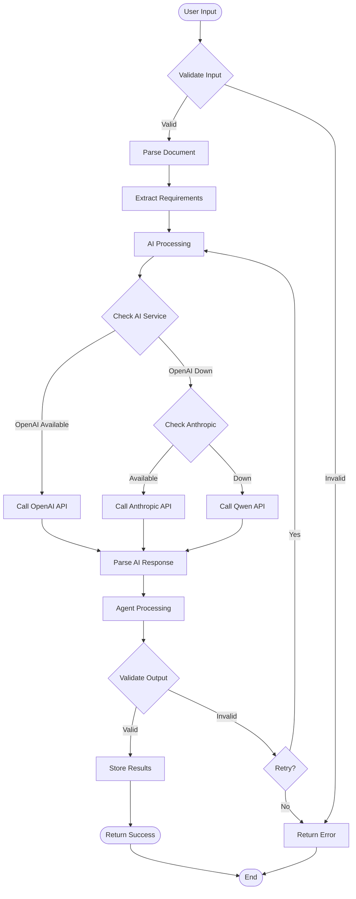
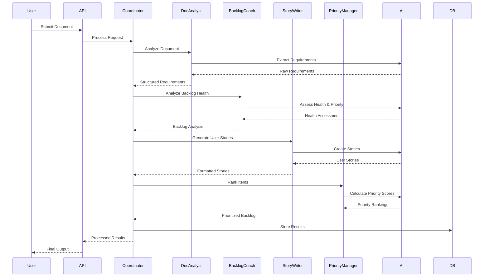
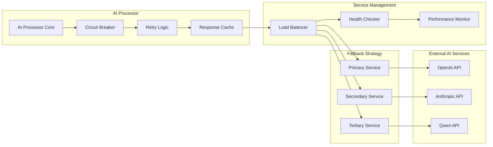
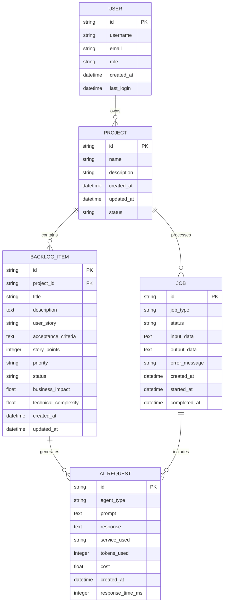
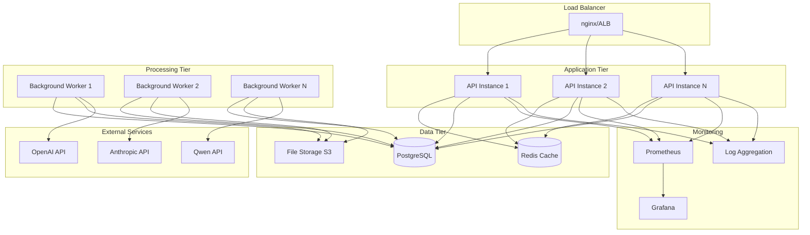
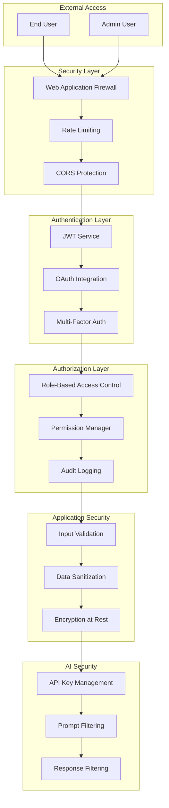
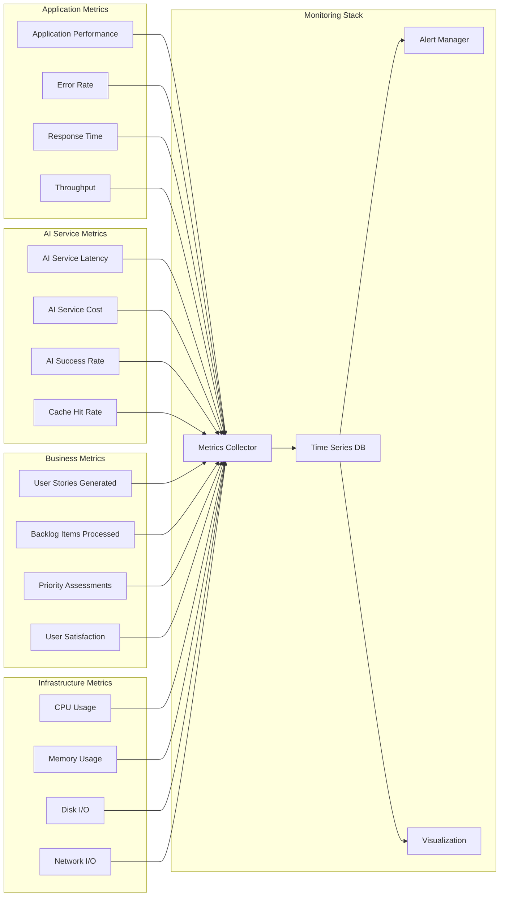
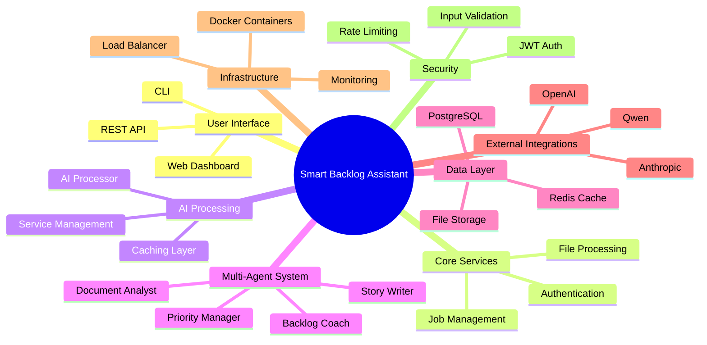

# Architecture Diagrams: Smart Backlog Assistant

## System Architecture Overview

## Data Flow Architecture

## Multi-Agent Interaction Flow

## AI Service Integration Architecture

## Database Schema Architecture

## Deployment Architecture

## Security Architecture

## Performance Monitoring Architecture

## Component Interaction Map

