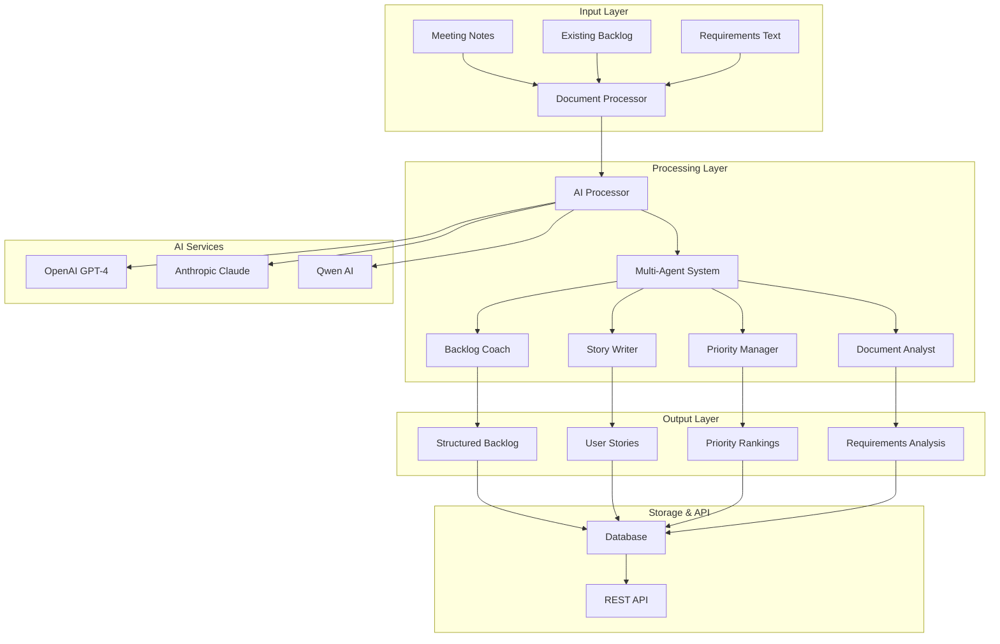

# Solution Design: Smart Backlog Assistant

## Architecture Overview

For detailed architecture diagrams, see **[Architecture Diagrams](./ARCHITECTURE_DIAGRAMS.md)**



## Core Components

### 1. Document Processor
- **Purpose**: Parse and normalize input documents
- **Input**: Text files, markdown, JSON, meeting notes
- **Output**: Structured content for AI processing
- **AI Usage**: Text extraction and formatting

### 2. AI Processor
- **Purpose**: Handle communication with multiple AI services
- **Features**: 
  - Service fallback (OpenAI → Anthropic → Qwen)
  - Retry logic with exponential backoff
  - Response caching
- **AI Usage**: API integration and response management

### 3. Multi-Agent System
- **Backlog Coach**: Analyzes backlog health and provides recommendations
- **Story Writer**: Converts requirements into user stories
- **Priority Manager**: Assesses and ranks backlog items
- **Document Analyst**: Extracts requirements from unstructured text

### 4. Data Models
- **AI Models**: Request/Response structures for AI services
- **Backlog Models**: User stories, backlog items, projects
- **Base Models**: Enums, validation, health scoring

## Data Flow

1. **Input Ingestion**: Documents are processed and normalized
2. **AI Analysis**: Content is sent to AI services with specific prompts
3. **Agent Processing**: Specialized agents analyze AI responses
4. **Output Generation**: Structured backlog items are created
5. **Storage**: Results are stored and made available via API

## Prompt Design Approach

### Agent-Specific Prompts

#### Backlog Coach Prompt
```
You are an experienced Agile coach analyzing a product backlog. 
Review the following backlog items and provide:
1. Health score (1-10) for each item
2. Recommendations for improvement
3. Priority assessment based on business value
4. Risk assessment for each item

Backlog items: {backlog_items}

Focus on clarity, completeness, and actionability.
```

#### Story Writer Prompt
```
You are a product owner specializing in user story creation.
Convert the following requirement into detailed user stories:

Requirement: {requirement}

For each story, provide:
1. User story format: "As a [user type], I want [functionality] so that [benefit]"
2. Acceptance criteria (3-5 specific, testable criteria)
3. Story points estimate (Fibonacci scale)
4. Definition of done

Ensure stories are independent, negotiable, valuable, estimable, small, and testable.
```

#### Priority Manager Prompt
```
You are a senior product manager prioritizing backlog items.
Analyze the following items and provide:

Items: {backlog_items}

For each item, assess:
1. Business impact (1-10)
2. Technical complexity (1-10)
3. User value (1-10)
4. Implementation risk (Low/Medium/High)
5. Priority score (weighted calculation)

Consider market impact, user feedback, technical debt, and strategic alignment.
```

### Prompt Engineering Principles

1. **Role-Based Context**: Each agent has a specific role and expertise
2. **Structured Output**: Clear formatting requirements for consistent parsing
3. **Examples and Guidelines**: Specific instructions for quality standards
4. **Constraint Handling**: Explicit boundaries and considerations
5. **Fallback Logic**: Graceful handling of ambiguous or incomplete inputs

## AI Integration Strategy

### Service Selection
- **Primary**: OpenAI GPT-4 for complex reasoning
- **Secondary**: Anthropic Claude for safety and consistency
- **Fallback**: Qwen AI for cost-effective processing

### Caching Strategy
- **Response Caching**: Cache similar requests to reduce API costs
- **Session Caching**: Maintain context within processing sessions
- **User Preferences**: Cache team-specific formatting and priorities

### Error Handling
- **Service Failover**: Automatic switching between AI services
- **Retry Logic**: Exponential backoff for transient failures
- **Graceful Degradation**: Provide basic functionality even with AI failures

## Technology Stack

- **Backend**: Python 3.12 with FastAPI
- **AI Integration**: OpenAI, Anthropic, and Qwen APIs
- **Database**: SQLAlchemy with PostgreSQL/SQLite
- **Processing**: Async processing with circuit breakers
- **Containerization**: Docker for deployment
- **Testing**: pytest with coverage reporting

## AI-Assisted Design Decisions

### Architecture Optimization
Used AI to analyze microservices vs monolithic approaches, settling on a modular monolith for this scope.

### Prompt Refinement
Iterated on prompt designs using AI feedback to improve response quality and consistency.

### Error Handling Strategy
AI-assisted analysis of common failure modes informed the circuit breaker and retry logic implementation.

## Performance Considerations

- **Async Processing**: Non-blocking AI API calls
- **Connection Pooling**: Reuse connections to AI services
- **Rate Limiting**: Respect API limits and prevent throttling
- **Memory Management**: Efficient handling of large documents
- **Caching**: Reduce redundant AI API calls

## Security and Privacy

- **API Key Management**: Secure storage of AI service credentials
- **Data Sanitization**: Remove sensitive information before AI processing
- **Audit Logging**: Track all AI interactions for compliance
- **Local Processing**: Option for on-premises AI model deployment
